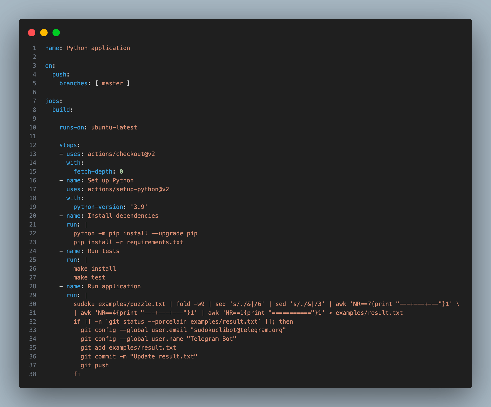

<!-- TOC depthfrom:2 -->

- [TL;DR](#tldr)
- [Prerequisites](#prerequisites)
  - [How to Create a New Telegram Bot](#how-to-create-a-new-telegram-bot)
- [From DevOps to BotOps](#from-devops-to-botops)
- [Deep dive into the GitHub Actions Configuration](#deep-dive-into-the-github-actions-configuration)
- [Steps to Configure Your Pipedream Workflow](#steps-to-configure-your-pipedream-workflow)
  - [Step 1. Listen for Commmand from Telegram Bot Trigger.](#step-1-listen-for-commmand-from-telegram-bot-trigger)
  - [Step 2. Create or Update File Contents in a GitHub Repository.](#step-2-create-or-update-file-contents-in-a-github-repository)
  - [Step 3. Workflow Delay.](#step-3-workflow-delay)
  - [Step 4. Get File Contents from a GitHub Repository.](#step-4-get-file-contents-from-a-github-repository)
  - [Step 5. Send Text Message or Reply to Telegram Bot.](#step-5-send-text-message-or-reply-to-telegram-bot)
- [Conclusion](#conclusion)
- [Get the Source Code](#get-the-source-code)
- [What To Do Next](#what-to-do-next)

<!-- /TOC -->

---
## TL;DR

[Telegram](https://telegram.org) isn't just for sending and receiving chat messages. It's also for automating your dialog flow, including workflow.

Using a Telegram Bot gives you the ability to check prices, query status, solve puzzles, and even have a fun conversation.

And if you're a serious developer or engineer, you can create your own Telegram Bot to manage your servers, view user details, and open or close issues.

GitHub-Actions-Telegram-Bot is a Telegram bot that allow you to communicate with a GitHub Actions pipeline that may return an output message.

---
## Prerequisites

You'll need to create an account (no credit card required):
1. [Telegram](https://telegram.org)
2. [GitHub](https://github.com)
3. [Pipedream](https://pipedream.com)

---
### How to Create a New Telegram Bot

My previous article [Building a Telegram Chat with a MT4 Forex Trading Expert Advisor](https://dev.to/dennislwm/building-a-telegram-chat-with-a-mt4-forex-trading-expert-advisor-4p35) contains a prerequisite tutorial on [How to Create a New Telegram Bot](https://github.com/dennislwm/MT4-Telegram-Bot-Recon).

It is also worth checking out if you are a serious crypto or forex trader.

---
## From DevOps to BotOps

A [GitHub Actions](https://docs.github.com/en/actions/learn-github-actions/understanding-github-actions) is a continuous integration and continuous delivery (CI/CD) platform that allows you to automate your build, test, and deployment pipeline.

A typical workflow for a CI/CD pipeline is to make some changes to your repository files, then add and commit these file changes. The pipeline may trigger on a `push`, or any event types, that you have defined in a GitHub Actions config file.

We can extend this CI/CD pipeline by creating a webhook that listens for a Telegram bot command to start a chain of events, which includes automating the CI/CD pipeline. The result of the pipeline may then be returned to the Telegram bot.


In this article, you'll have a bit of fun by creating a Telegram Bot to automate solving a sudoku puzzle and returning the result.

You'll send a command (prefix with a `/`) to the Telegram Bot. For example:

```sh
/solve PUZZLE_STRING
```

This triggers a chain of events, which includes automating the GitHub Actions pipeline, and the result is a text message reply that contains the solved puzzle.


---
## Deep dive into the GitHub Actions Configuration

> TL;DR: If you want to save time, you can [fork the source code](#get-the-source-code) from my GitHub repository.

Before diving into configuring the workflow, let's take a peek at how the GitHub Actions configuration works.

To create a GitHub Actions pipeline, we have to specify:

* Name of the GitHub Actions `name`.
* Type of trigger events `on`.
* An array of jobs `jobs`.
  * A base image `runs-on`.
  * An array of steps `steps`.
    * Checkout git repo.
    * Set up Python.
    * Install dependencies.
    * Run tests.
    * Run application.

Let's look at an example.



We name the GitHub Actions `Python application`, and it will trigger on each `push` to the `master` branch.

There is one job `build` using the base image `ubuntu-latest` that runs each of the steps listed above.
* The first step checks out the git repository, with a minimum commit history of `fetch-depth`.
* The second and third steps install `Python 3.9` and the dependencies in `requirements.txt`.
* The fourth and fifth steps run the unit tests and application.

For the final step, the command `sudoku` reads the file `examples/puzzle.txt` containing a PUZZLE_STRING. The return output string is then piped through a series of formatting commands using `sed` and `awk` and into the file `examples/result.txt`. The `result.txt` file is compared to the last commit and a new commit is created only if there is a change in the file.

---
## Steps to Configure Your Pipedream Workflow

> TL;DR: If you want to save time, you can [copy the configuration](#get-the-source-code) from my Pipedream workflow.

In order to create a webhook that listens for your Telegram bot commands, and starts a chain of events, which includes automating the CI/CD pipeline, you'll need to create a workflow in [Pipedream](http://pipedream.com).

At a helicopter view, the steps to configure are as follows:
* Step 1. Listen for Commmand from Telegram Bot (Trigger).
* Step 2. Create or Update File Contents in a GitHub Repository.
* Step 3. Workflow Delay.
* Step 4. Get File Contents from a GitHub Repository.
* Step 5. Send Text Message or Reply to Telegram Bot.

Your TELEGRAM_BOT_TOKEN that you created in the [previous](#how-to-create-a-new-telegram-bot) section will come in handy here.

1. Navigate to your Pipedream dashboard > Projects.
2. Click New Project, and name the project **Telegram-Bot**.
3. Click Save, and your project should appear under Projects.
4. Click on your project name, navigate to Resources.
5. Click on New > Workflow, and name the workflow **Sudoku-Actions**.
6. Click Create Workflow, and your workflow should appear under Resources.

### Step 1. Listen for Commmand from Telegram Bot (Trigger).

Now that you have created a workflow, let's create a trigger.

1. Click on your workflow name, and search for **Telegram** app.
2. Select Telegram Bot > **New Bot Command Received (Instant)**.
  - In the Telegram Bot Account, select **Connect new account**.
  - In token, enter your TELEGRAM_BOT_TOKEN.
  - In nickname, enter your Telegram bot name.
3. Click Save, and your telegram bot should appear under Telegram Bot Account.
4. Select Commands > and select one or more commands.

Now to test your first action, open your Telegram app and send a command from your Telegram bot. For example:

```sh
/solve 600009130700000090209500004926345000800006340473001000197004603302007000508900007
```


### Step 2. Create or Update File Contents in a GitHub Repository.

Now that you have created a trigger, let's create some actions.

1. Click on the + icon (below your trigger), and search for **GitHub** app.
2. Select GitHub app, and search for **file contents**.
3. Select **Create or update file contents**.
  - In the GitHub Account, select **Connect new account**.
  - Follow the steps to connect your GitHub account.
4. Click Save, and your account should appear under GitHub Account.
5. Click Repository, search for and select **sudoku-cli**.
6. In Path, enter `examples/puzzle.txt`.
7. In File content, enter `{{steps.code.puzzle}}`.


### Step 3. Workflow Delay.

As the GitHub Actions pipeline may take some time to execute, you will need to set a fixed period of delay in your workflow.

1. Click on the + icon (below your previous), and search for **Workflow delay** app.
2. Select Worflow delay app.
3. In Duration to delay (value), enter `35`.
4. In Duration to delay (unit), enter `seconds`.


### Step 4. Get File Contents from a GitHub Repository.

The next step is to get the result from the repository.

1. Click on the + icon (below your trigger), and search for **GitHub** app.
2. Select GitHub app, and search for **get repository**.
3. Select **Get repository content**.
4. Click Repository, search for and select **sudoku-cli**.
5. In Path, enter `examples/result.txt`.


### Step 5. Send Text Message or Reply to Telegram Bot.

The final step is to send a text message to your Telegram bot.

1. Click on the + icon (below your trigger), and search for **Telegram** app.
2. Select Telegram app, and search for **send text**.
3. Select **Send text message or reply**.
4. Click Telegram Bot Account, search for and select **sudokuclibot**.
5. In Path, enter `{{steps.trigger.event.message.chat.id}}`.
6. In Text, enter `{{steps.base64_decode_string.data}}`.


---
## Conclusion

In this aarticle, you created a GitHub Actions to run a Python application `sudoku` that accepts a file containing a PUZZLE_STRING, and returns the result in an output file `result.txt`. You then created a Pipedream workflow that listens to your Telegram Bot for a given command `/solve PUZZLE_STRING` that starts a chain of events, which includes automating the CI/CD pipeline. The workflow then replies to your Telegram Bot with the contents of the file `result.txt`.

---
## Get the Source Code

You can copy the above configuration from my Pipedream workflow [Telegram Bot > Sudoku-Actions](https://pipedream.com/new?h=tch_egfA5N).

You can download the above source code from my GitHub repository [dennislwm/sudoku-cli](https://github.com/dennislwm/sudoku-cli).

---
## What To Do Next

You can further extend your code or configuration in several meaningful ways:

1. Reduce wait time - Instead of a using a workflow delay step in the Pipeline configuration, you may replace this step with sending the results directly from the GitHub Actions pipeline to your Telegram bot.
2. Add a new command - You can add new commands and actions to your Telegram bot to perform other tasks, such as transcribe a YouTube video, check next T-Bills auction dates, etc.

* * *

**Was this article useful? Help me to improve by replying in the comments.**

[](https://ko-fi.com/dennislwm "Donate to this project using Buy Me A Coffee")
